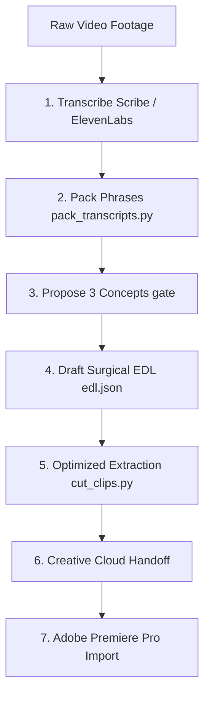

# Video-Use Skill: Agentic Video Editing & Premiere Handoff

This directory contains the `video-use` agentic skill, allowing coding assistants (such as Claude Code, Codex, and others) to edit raw video footage through natural conversation, perform frame-accurate selects, and sync them directly to Adobe Premiere Pro.

---

## 🎬 Core Edit Workflow

The skill organizes the edit workflow into an audio-first, manifest-driven pipeline:



### 1. Inventory & Transcription
*   **Action**: The agent runs `transcribe_batch.py` (which parallelizes calls to Scribe/ElevenLabs API) or `transcribe.py`.
*   **Output**: Word-level timestamps, speaker IDs, and verbatim audio mappings saved in `edit/transcripts/<src_name>.json`.

### 2. Packing Transcripts
*   **Action**: The agent runs `pack_transcripts.py --edit-dir edit`.
*   **Output**: Creates [takes_packed.md](file:///Users/sebastian/Library/CloudStorage/GoogleDrive-sebastian.wittekindt@gmail.com/My%20Drive/Communism/International%20Centre/VideoStudio/footage/edit/takes_packed.md) — a high-density, readable view that groups speech into phrases separated by silences (≥0.5s) with exact start/end times. This minimizes token usage while keeping word boundaries clear.

### 3. Concept Gate (Three-Idea Brainstorm)
*   **Action**: Based on the packed transcript, the agent designs **exactly three distinct editorial angles** (Hooks, Claims, structural flow) and presents them to the user.
*   **Rule**: The agent **must stop and wait** for the user to select or refine a concept before writing any cut decisions.

### 4. Surgical EDL Drafting
*   **Action**: The agent writes edit decisions into [edl.json](file:///Users/sebastian/Library/CloudStorage/GoogleDrive-sebastian.wittekindt@gmail.com/My%20Drive/Communism/International%20Centre/VideoStudio/footage/edit/edl.json).
*   **Precise Rule**: Timestamps must be surgically aligned with the millisecond-accurate word boundary timestamps from Scribe (start of the first word, end of the last word). Manual padding is forbidden; all pacing is determined by these boundaries.

### 5. Optimized Clip Extraction
*   **Action**: The agent runs `cut_clips.py --edit-dir edit --handles <val> --codec prores`.
*   **Performance Optimization**: Utilizes **input-side seeking** (`-ss` before `-i` in FFmpeg) to seek instantly inside multi-gigabyte source files. This speeds up extraction by ~25x (from ~45 minutes to under 2 minutes).
*   **Handles Option**:
    *   `--handles 1.0` (default): Adds 1.0s of pre/post-roll safety padding for fine slipping/trimming in Premiere.
    *   `--handles 0.0`: Cuts exactly to the word boundaries, producing clips that fit back-to-back with perfect pacing out of the box.

### 6. Creative Cloud Handoff
*   **Action**: The agent copies the selects (`seg_00_...mov` to `seg_NN_...mov`) and `manifest.json` to the user's Creative Cloud sync folder:
    `~/Creative Cloud Files/VideoStudio/<project_slug>/take-extract-<segment_title>/`
*   ** Premiere Pro Import**: The editor simply imports the synced folder into Premiere. Sorting the clips by name places them in timeline order for immediate rough assembly.

---

## 📦 How to Bundle & Share

When sharing this skill with other team members, you must **exclude local configuration and secrets** (like API keys). 

Run the following command from the folder containing the `video-use` directory to create a clean zip file:

```bash
zip -r video-use-skill.zip video-use \
  -x "video-use/.env" \
  -x "video-use/helpers/__pycache__/*" \
  -x "video-use/.DS_Store" \
  -x "video-use/helpers/.DS_Store"
```

---

## 🚀 Quick Installation Guide for Team Members

Once your team members unzip the folder:

1.  **Dependencies**: Ensure `ffmpeg` and `ffprobe` are installed and available on their system `$PATH`.
2.  **Stable Path**: Move the `video-use` folder to a stable directory (e.g. `~/Developer/video-use`).
3.  **Python Packages**: Run dependencies sync:
    ```bash
    cd ~/Developer/video-use
    pip install -e .
    ```
4.  **ElevenLabs Credentials**: Generate an ElevenLabs API key and save it in a `.env` file at the root of the skill folder:
    ```env
    ELEVENLABS_API_KEY=your_key_here
    ```
5.  **Agent Registration**: Register the skill with their coding agent by symlinking the directory. For example, in **Claude Code**:
    ```bash
    mkdir -p ~/.claude/skills
    ln -sfn ~/Developer/video-use ~/.claude/skills/video-use
    ```

For full setup troubleshooting, refer to [install.md](file:///Users/sebastian/Library/CloudStorage/GoogleDrive-sebastian.wittekindt@gmail.com/My%20Drive/Communism/International%20Centre/VideoStudio/video-use/install.md).
